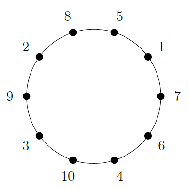
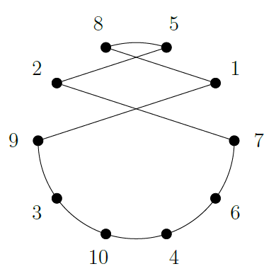
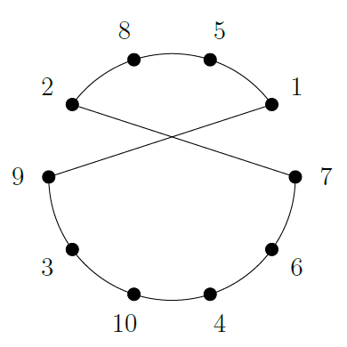
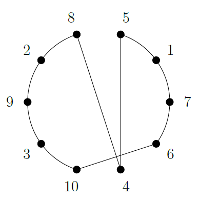
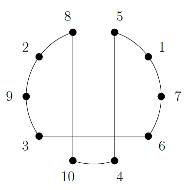
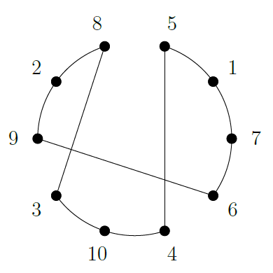

# TSP Solver (Traveling Salesman Problem)

This project implements a solution to the **Traveling Salesman Problem (TSP)** using **C++**. The goal is to find the shortest possible route that visits all cities exactly once and returns to the starting city.

## 💻 About the Project

This project focuses on solving the **Traveling Salesman Problem (TSP)**, a classic combinatorial optimization problem. The primary objective is to minimize the total travel distance while visiting all cities exactly once and returning to the starting point. This problem has real-world applications in various fields such as vehicle routing, circuit design, logistics, and more.

### **Created By:**
- **Ambuj Mishra** (22BBS0148)
- **Samarth Patel** (22BBS0196)
- **Siddharth Partani** (22BBS0220)

The project was developed as part of the **Design and Analysis of Algorithms** course, focusing on **Tour Optimization** using **TSP** and **Shortest Distance** algorithms.

## 🧠 Algorithm

The algorithm used in this project leverages neighborhood search strategies to optimize the route and provide an optimal or sub-optimal solution in an efficient manner. The following neighborhood structures are used:

- **BestImprovementSwap**: This strategy swaps the positions of two vertices in the sequence to find the most beneficial improvement.
  
- **BestImprovement2Opt**: This involves removing two non-adjacent edges and reversing the segment between them, effectively adding two new edges and improving the solution.

- **BestImprovementOrOpt (size=1)**: A reinsertion strategy where a single vertex is removed from its position and inserted into another.

- **BestImprovementOrOpt (size=2)**: A block of two adjacent vertices is removed and reinserted at another position in the sequence.

- **BestImprovementOrOpt (size=3)**: A block of three adjacent vertices is removed and reinserted at another location in the sequence.

### Visuals of Neighborhood Structures:
<p align="center">
  
  <br>Original Structure
</p>

<div align="center">
  <table>
    <tr>
      <td style="text-align: center; vertical-align: top; padding: 10px;">
        <br/>
        <b>BestImprovementSwap</b>
      </td>
      <td style="text-align: center; vertical-align: top; padding: 10px;">
        <br/>
        <b>BestImprovement2Opt</b>
      </td>
    </tr>
  </table>
  <table>
    <tr>
      <td style="text-align: center;">
        <br/>
        <b>BestImprovementOrOpt (Size=1)</b>
      </td>
      <td style="text-align: center;">
        <br/>
        <b>BestImprovementOrOpt (Size=2)</b>
      </td>
      <td style="text-align: center;">
        <br/>
        <b>BestImprovementOrOpt (Size=3)</b>
      </td>
    </tr>
  </table>
</div>

## 🔧 Prerequisites

To compile and run this project, you will need:

- [GCC](https://gcc.gnu.org/) or any compatible C++ compiler
- [CMake](https://cmake.org/) (optional, to ease the build process)

### Compilation

To compile the project, you can use CMake or a manual build process. If using CMake, run:

```bash
make


## 🚀 How to Use

1. Clone the repository to your local machine:

```bash
git clone https://github.com/your-username/your-repository.git
```

2. Compile the code following the instructions above.
3. Run the program by providing an input file with the distances between cities:

```bash
Format: ./tsp instances/{name_of_instance}.tsp
Ex: ./tsp instances/bays29.tsp
```

Running the program will output something like:

```
Original cost of instances/bays29.tsp: 5752
Solution: 0 27 7 22 26 23 15 18 6 24 10 21 13 16 17 14 3 19 9 12 20 1 2 28 25 4 8 5 11 0
Optmized cost: 2131
Execution Time: 0.0848794 seconds.
```